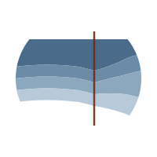

<div class="its2s-hero">
  
  <h1 class="its2s-hero-title">its2s</h1>
</div>

<dl class="its2s-glossary">
  <dt>
    <span class="word">its2s</span>
    <span class="ipa">/ˈɪts.tuː.ɛs/</span>
    <span class="pos">noun</span>
  </dt>
  <dd>
    <ol>
      <li>An open-source Python package for <strong>i</strong>nterrupted <strong>t</strong>ime <strong>s</strong>eries, <strong>2</strong>-<strong>s</strong>tage counterfactual analysis with moving-block bootstrap confidence intervals.</li>
      <li>A modular framework for fitting ITS models with cross-validation, hyperparameter tuning, and reproducible end-to-end workflows.</li>
    </ol>
  </dd>
</dl>

<!-- Use `its2s` in your own Python environment: load a tabular time series (or simulate one), call `run_single_its`, and write plots and tables to a folder. -->

<!-- For comprehensive methodological details, see [insert paper link here when applicable]. -->

## Why `its2s`?

- **Flexibility:** `its2s` is designed to be flexible, allowing you to easily use this methodology with any data, model, and settings.
- **Modularity:** `its2s` is designed to be modular, allowing you to use the parts of the pipeline that you need.
- **Reproducibility:** `its2s` is designed to be reproducible via seeding and rigorous parameter documentation, allowing you to reproduce the results of your analysis easily.
- **Efficiency:** `its2s` is designed to run quickly and efficiently, allowing you to run the analysis quickly and easily.

## Core API

| Function | Overview | Inputs | Outputs |
|----------|----------|--------|---------|
| `run_single_its` | End-to-end ITS pipeline for a single series: split, fit, bootstrap, score, save outputs. | `df`, `intervention_date`, `model_name` (`prophet_xgb` / `prophet_then_xgb` / `neuralprophet` / `arima`), optional `config_path` / `config_overrides`, optional `output_dir` | `PipelineResult` (+ files when `output_dir` is set) |
| `run_batch` | Run the pipeline over many series, optionally in parallel. | `series_list` (list of dicts with `series_id`, `df`, `intervention_date`, …), optional `config_path`, `output_dir`, `n_jobs`, `seed` | list of `PipelineResult` |

```python
from its2s import run_single_its, run_batch
```

## Additional functionality

| Function | Overview | Inputs | Outputs |
|----------|----------|--------|---------|
| `compare_models` | Fit several models on the same series and compare metrics side-by-side. | `df`, `intervention_date`, `model_names`, optional config / overrides, `output_dir` | comparison DataFrame + per-model `PipelineResult` |
| `tune_model` | Latin hypercube hyperparameter search via expanding-window CV. Run **before** `run_single_its` to pick hyperparameters, then pass `best_params` via `config_overrides`. | `df`, `intervention_date`, `model_name`, `n_trials`, `n_folds`, optional `metric` / `cv_end_date` | `TuningResult` (best params + per-trial scores) |

```python
from its2s import compare_models, tune_model
```

## What's next?

- **[Setup](installation.md)** — install the package into a Python environment.
- **[Quick Start](quickstart.md)** — a minimal example using simulated data, plus your-own-data, outputs, covariates, and configuration.
- **[Tutorials](tutorials/step1_data_splitting.ipynb)** — six step-by-step notebooks: data splitting, cross-validation, hyperparameter tuning, model variants, moving-block bootstrap, and a full end-to-end workflow.
- **[API Reference](api.md)** — function signatures and docstrings for the public API.
- **[Citation](citation.md)** — how to cite `its2s`.

## Getting help and contributing

If you have a question, feature request, or bug, please [open an issue](https://github.com/causal-its/its2s/issues).

## Contact

Maintained by: 
- Arnab Dey: [arnabxdey@gmail.com](mailto:arnabxdey@gmail.com) · [@arnabkdey on GitHub](https://github.com/arnabkdey)
- Lauren Wilner: [wilnerl@uw.edu](mailto:wilnerl@uw.edu) · [@laurenwilner on GitHub](https://github.com/laurenwilner)
